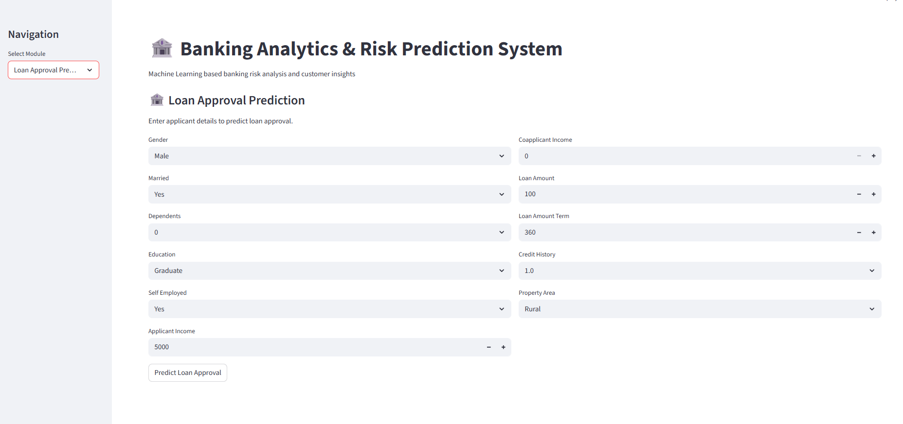
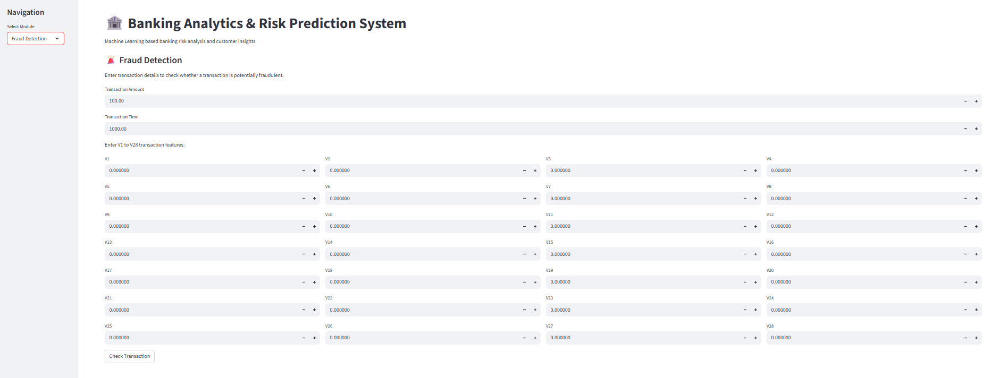

\# 🏦 Banking Analytics \& Risk Prediction System


A Machine Learning based Banking Analytics \& Risk Prediction System built using Python and Streamlit.


The project combines banking data analytics with machine learning to support loan approval prediction, credit risk analysis, fraud detection, and customer segmentation through an interactive web application.


\## 🚀 Project Modules


\### 1. Loan Approval Prediction


Predicts whether a loan application is likely to be approved based on applicant and loan-related information.


\### 2. Credit Risk Prediction


Predicts the credit risk level of a customer using machine learning models.


\### 3. Fraud Detection


Detects potentially fraudulent credit card transactions using a machine learning model.


\### 4. Customer Segmentation


Groups customers into meaningful segments based on their characteristics and behavior.


\## 🛠️ Technologies Used


\* Python

\* Pandas

\* NumPy

\* Scikit-learn

\* Streamlit

\* Jupyter Notebook

\* MySQL

\* Power BI

\* Pickle


\## 📂 Project Structure


```text

Banking Analytics \& Risk Prediction System/

│

├── app.py

├── .gitignore

├── README.md

│

├── data/

│   └── CSV datasets

│

├── models/

│   ├── loan\_prediction\_model.pkl

│   ├── loan\_scaler.pkl

│   ├── credit\_risk\_model.pkl

│   ├── credit\_risk\_scaler.pkl

│   ├── credit\_risk\_balanced\_model.pkl

│   ├── credit\_risk\_balanced\_scaler.pkl

│   ├── fraud\_detection\_model.pkl

│   ├── fraud\_scaler.pkl

│   ├── customer\_segmentation\_model.pkl

│   └── customer\_segmentation\_scaler.pkl

│

├── notebooks/

│   ├── 01\_loan\_prediction.ipynb

│   ├── 02\_credit\_risk\_prediction.ipynb

│   ├── 03\_fraud\_detection.ipynb

│   └── 04\_customer\_segmentation.ipynb

│

├── dashboard/

│   └── Power BI Dashboard

│

├── import\_credit\_risk.py

├── import\_customer\_segments.py

├── import\_fraud\_data.py

├── import\_loan\_data.py

│

├── banking\_analytics\_database.sql

└── banking\_analytics\_database\_1.sql

```


\## ⚙️ Installation \& Setup


\### 1. Clone the repository


```bash

git clone https://github.com/harshitb897-tech/banking-analytics-risk-prediction-system.git

```


\### 2. Open the project folder


```bash

cd banking-analytics-risk-prediction-system

```


\### 3. Install required Python libraries


```bash

pip install pandas numpy scikit-learn streamlit

```


\### 4. Run the Streamlit application


```bash

python -m streamlit run app.py

```


The application will open in your browser.


\## 📊 Machine Learning Workflow


```text

Data

&#x20; ↓

Data Preprocessing

&#x20; ↓

Feature Engineering

&#x20; ↓

Model Training

&#x20; ↓

Model Evaluation

&#x20; ↓

Saved ML Models

&#x20; ↓

Streamlit Application

&#x20; ↓

Predictions \& Analytics

```


\## 📁 Dataset Note


The CSV datasets are not included in the GitHub repository because some files are large.


The machine learning models, notebooks, application code, SQL files, and project structure are included in the repository.


\## ✨ Key Features


* Interactive Streamlit web application
* Loan approval prediction
* Credit risk prediction
* Credit card fraud detection
* Customer segmentation
* Machine learning model integration
* MySQL database integration
* Power BI dashboard integration
* Jupyter notebooks for model development

## 🖥️ Application Screenshots

### Loan Approval Prediction


### Credit Risk Prediction


### Fraud Detection


### Customer Segmentation


\## 👨‍💻 Author


Harshit Kumar


GitHub:

https://github.com/harshitb897-tech


